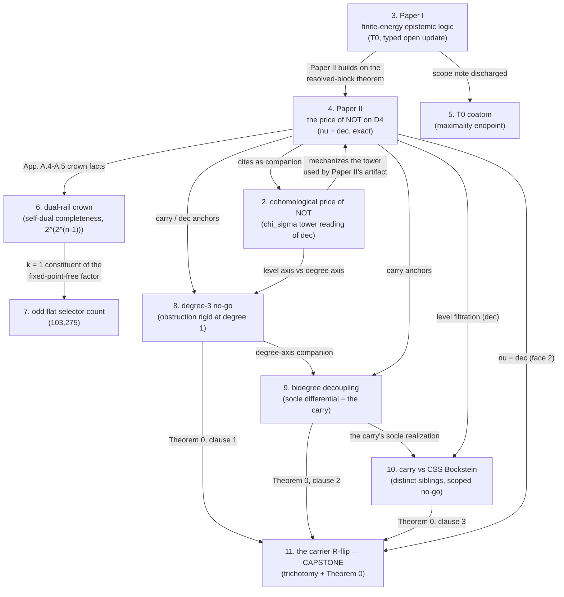

# The Dual-Rail Carrier Program

**Won Chul Yang** — Independent Researcher — wcy0969@gmail.com

This is the hub of a series of machine-verified mathematics releases
about **dual-rail and flat carrier lattices**: small height-two lattices
D4 = {UNK, FAL, TRU, CON} and their flat generalizations, the clones
generated by their lattice operations and rail-swap involutions, and the
exact laws — negation cost, completeness fragments, extension counts —
that live on their resolved faces.

Every release in the series follows the same discipline:

- **full proofs** at journal standard — no proof sketches;
- **machine verification** in dependency-minimal Lean 4 (core only, no
  mathlib, no `native_decide`, no `sorry`; kernel axiom profile at most
  `[propext, Quot.sound]`), plus independent exhaustive replays of all
  finite claims — with any certificate-level computational premises
  declared explicitly;
- **honest scope**: what is proved, what is certified computation, and
  what remains open are separated in print;
- **full provenance**: the mathematics is the author's; AI assistance
  (Anthropic Claude family) is used for the machine-verification layer,
  with the Lean 4 kernel as the acceptance gate — except where a release
  is explicitly labeled AI-collaborative;
- **archival**: GitHub + Zenodo DOI (concept DOIs below always resolve
  to the latest version), Apache-2.0 (code/Lean/certificates) +
  CC BY 4.0 (text).

## The releases

| # | Release | Result | DOI |
|---|---|---|---|
| 1 | [inversion-wilf-spi](https://github.com/ycmath/inversion-wilf-spi) | Wilf-type inversion/SPI results (AI-collaborative release) | [10.5281/zenodo.21474657](https://doi.org/10.5281/zenodo.21474657) |
| 2 | [cohomological-price-of-not](https://github.com/ycmath/cohomological-price-of-not) | The decrease invariant acquires a cohomological address: χ_σ is the unique character pricing negation; d(f) = minimal nested χ_σ-tower length (AI-collaborative release) | [10.5281/zenodo.21775055](https://doi.org/10.5281/zenodo.21775055) |
| 3 | [finite-energy-epistemic-logic](https://github.com/ycmath/finite-energy-epistemic-logic) | **Paper I.** Ternary logic of explicit unresolved states: T₀ as the load-bearing obstruction, conservative pointed extension by typed open update, finite-energy event bounds, dual-rail negation geometry | [10.5281/zenodo.21800031](https://doi.org/10.5281/zenodo.21800031) |
| 4 | [price-of-not-on-d4](https://github.com/ycmath/price-of-not-on-d4) | **Paper II.** The exact negation-complexity law ν(f) = dec(f) on the resolved face of D4 — the four-valued, formula-exact counterpart of Markov/Morizumi | [10.5281/zenodo.21800033](https://doi.org/10.5281/zenodo.21800033) |
| 5 | [t0-coatom-ternary](https://github.com/ycmath/t0-coatom-ternary) | T₀ = Pol({0}) is a maximal clone on {0,1,2}: a self-contained, kernel-verified Słupecki-style endpoint proof | [10.5281/zenodo.21866478](https://doi.org/10.5281/zenodo.21866478) |
| 6 | [dual-rail-crown](https://github.com/ycmath/dual-rail-crown) | The resolved-face crown: the closed core's outer fragment = the self-dual clone; count 2^(2^(n−1)); one-constant completion | [10.5281/zenodo.21866741](https://doi.org/10.5281/zenodo.21866741) |
| 7 | [odd-flat-selector-count](https://github.com/ycmath/odd-flat-selector-count) | On the odd flat carrier: the linear routing law refuted; the exact ternary selector count C(3, k≥3) = 103,275 | [10.5281/zenodo.21868044](https://doi.org/10.5281/zenodo.21868044) |
| 8 | [demorgan-degree-three-no-go](https://github.com/ycmath/demorgan-degree-three-no-go) | No genuine degree-three De Morgan cohomology of the carrier, either characteristic: separability vacuum + sharp counter-family (char 0), four-corner collapse (char 2) — degree-axis rigidity | [10.5281/zenodo.21868976](https://doi.org/10.5281/zenodo.21868976) |
| 9 | [carry-bidegree-decoupling](https://github.com/ycmath/carry-bidegree-decoupling) | The carry is the socle differential of the resolved block (Ext¹ class = resolved-face character), and it decouples from every degree-three Hochschild/associator class by first-quadrant index arithmetic, uniformly in r | [10.5281/zenodo.21869440](https://doi.org/10.5281/zenodo.21869440) |
| 10 | [carry-qec-distinct-siblings](https://github.com/ycmath/carry-qec-distinct-siblings) | The carry and the CSS-code Bockstein obstructions are distinct siblings: native tower stops (all m), twisted tower absorbs (δ(e)=0), axiom-scoped no-go — with the external anchor verified at the equation level | [10.5281/zenodo.21869871](https://doi.org/10.5281/zenodo.21869871) |
| 11 | **[carrier-r-flip](https://github.com/ycmath/carrier-r-flip)** (capstone) | The R-flip: one degree-one, 2-primary obstruction with three faces — the receptor trichotomy (carry ≠ dec, witness P), Theorem 0 (cohomological minimality) assembled from the published companions, and the Isaksen degree-two contrast. Lean: 30 theorems, all axiom-free | [10.5281/zenodo.21870654](https://doi.org/10.5281/zenodo.21870654) |

## How the releases fit together

The Lean developments are shared where the mathematics is: the coatom
release reuses Paper I's `Ternary`/`Theory` modules; the crown release
extends Paper II's `Wcy2` library; the selector-count release ships an
independent `FlatCarrier` library (abstract Baker–Pixley interpolation +
concrete nine-element carrier).

## Open problems of the program

Stated precisely in the individual papers; headline items:

- the general-arity extension count C(n, k) on the odd flat carrier
  (n ≥ 4), and the location of the routing/signature-isolation boundary;
- the equal-fiber factorization of the full restriction count (open for
  n ≥ 3);
- the general fixed-point-free product formula (proved only in its k = 1
  crown constituent);
- extension of the crown theory beyond the single-orbit case (the
  routing/signature program).

## Reproducing

Each repository is self-contained: `lake build` inside its `lean/`
directory rebuilds the machine-verified layer (toolchain pinned by
`lean-toolchain`); each `verification/` directory contains exhaustive
replay scripts with frozen outputs, and — where certificate-level
computations are consumed — the certificates plus an independently
rebuilt copy.

The release checklist used by the series is in
[RELEASE_STANDARDS.md](RELEASE_STANDARDS.md).

## License

Text: CC BY 4.0. The individual releases carry their own licenses
(Apache-2.0 for code/Lean/certificates, CC BY 4.0 for text).
